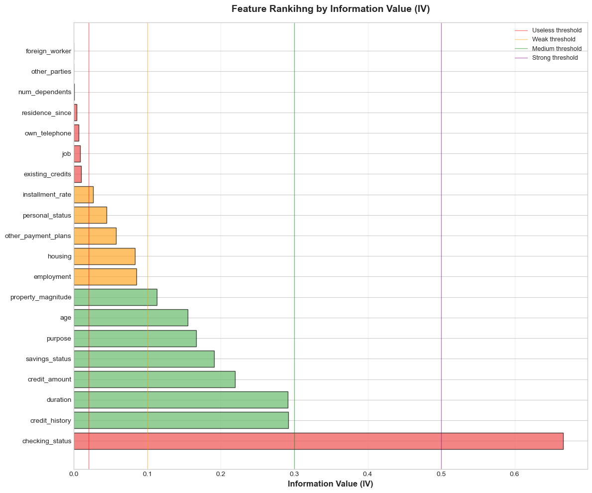
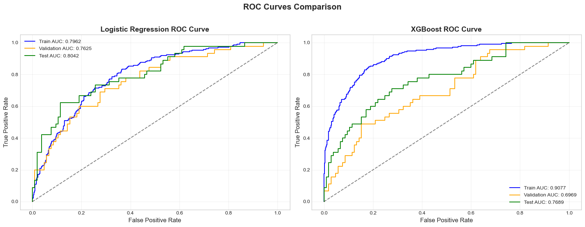
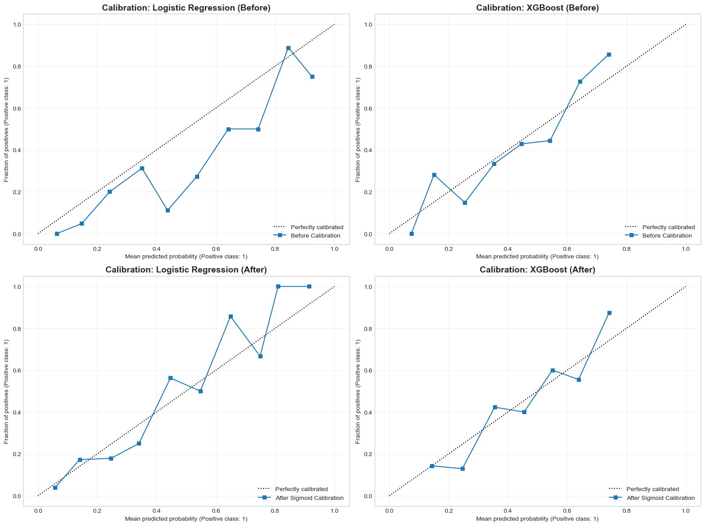
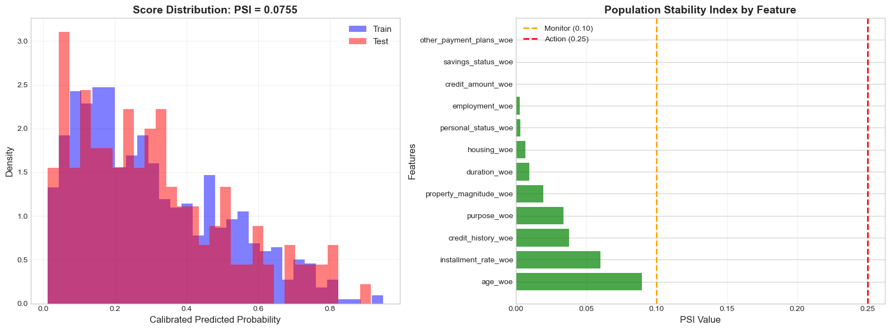
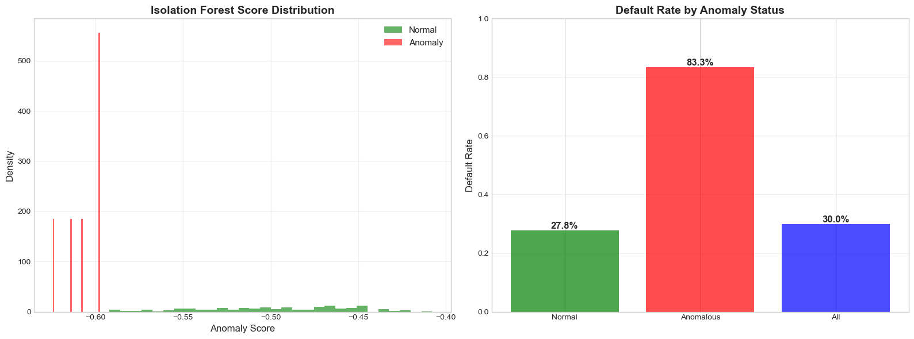

# Credit Risk PD Modeling & Validation

This repository presents an **end-to-end Probability of Default (PD) modeling workflow** in a
**credit risk / scorecard setting**, covering:

- credit fundamentals and EDA,
- WOE / IV–based feature engineering,
- PD modeling with Logistic Regression and XGBoost,
- calibration, stability, and validation beyond AUC.

The focus is not on algorithmic novelty, but on **model interpretability, probability quality,
and validation practices aligned with real-world credit risk modeling**.

This repository is organized into three main notebooks, each corresponding to a stage
of the credit risk modeling lifecycle:

- `Credit_Fundamentals.ipynb`: credit fundamentals and exploratory analysis  
- `PD_Modeling.ipynb`: WOE/IV-based PD modeling and model comparison  
- `Model_Validation.ipynb`: calibration, stability, and validation diagnostics  

Recommended execution order:
1. Credit_Fundamentals.ipynb  
2. PD_Modeling.ipynb  
3. Model_Validation.ipynb
---

## Data
Train–test splitting is performed using a stratified random split.
No temporal or cohort-based split is applied in this experiment.

- **Dataset**: German Credit Data (Statlog, UCI ML Repository)
- **Target**: Binary default indicator
- **Setting**: Consumer credit risk classification

---

## Workflow Overview

1. Credit fundamentals and exploratory analysis  
3. Model performance comparison using identical WOE-transformed feature sets
3. Model performance comparison  
4. Probability calibration and validation (Brier, ECE, PSI, anomaly analysis)

---

## Credit Fundamentals & Exploratory Analysis

This section establishes the credit-risk context and data characteristics before modeling.

### Population Default Rate
The overall default rate highlights class imbalance and motivates the use of
proper evaluation metrics beyond accuracy.

---

## PD Modeling with WOE / IV

WOE transformation and IV-based feature selection are applied to ensure
**interpretability and stability**, consistent with traditional scorecard modeling.

### Information Value (Top Features)
Features are ranked by IV to assess their individual predictive contribution.

### Model Performance (ROC – Test Set)
Logistic Regression and XGBoost are compared on the held-out test set.

ROC and KS statistics evaluate ranking performance only.
Final credit decisions and monitoring rely on calibrated PDs rather than raw scores.

**Observed results (test set):**
- Logistic Regression AUC ≈ **0.80**, KS ≈ **0.51**
- XGBoost AUC ≈ **0.77**, KS ≈ **0.43**

Despite higher training performance, XGBoost exhibits stronger overfitting
and less stable rank-ordering on the test set,
while Logistic Regression provides more **robust generalization,
calibration stability, and interpretability**.

---

## Model Validation & Calibration

Model validation focuses on **probability quality and deployment readiness**,
not just rank-ordering. Brier score measures overall probability accuracy,
while Expected Calibration Error (ECE) captures bin-level miscalibration
between predicted PDs and observed default rates.

### Calibration Curves (Reliability Plots)
Predicted PDs are calibrated using sigmoid (Platt) scaling and evaluated
against observed default frequencies.

### Key Validation Results (Test Set, Calibrated)

- **Logistic Regression**:  
  AUC ≈ **0.81**, Brier ≈ **0.15**, ECE ≈ **0.07**  
  → Strong calibration and stable generalization

- **XGBoost**:  
  AUC ≈ **0.78**, Brier ≈ **0.16**, ECE ≈ **0.06**  
  → Competitive discrimination, but weaker stability

### Population Stability Index (PSI)
PSI is used to assess distributional stability between training and test samples.

PSI values are computed between training and test splits within the same dataset.
They should be interpreted as relative stability diagnostics rather than
full production-level population monitoring.

Low-to-moderate PSI values indicate no severe population shift in this experiment.

### Anomaly Analysis (Supplementary)
This analysis is supplementary and does not affect model estimation.
It is intended to highlight segments with elevated risk concentration.

An Isolation Forest is applied to identify anomalous observations.
Anomalous segments exhibit substantially higher default rates.

---

## Conclusion

This project shows that in a classical credit scorecard setting, interpretability,
probability calibration, and stability diagnostics are as important as discrimination
metrics such as AUC or KS.

WOE-based Logistic Regression delivers competitive ranking performance while maintaining
transparent structure, stable generalization, and well-behaved probability estimates.
More complex models, such as gradient boosting, may achieve stronger in-sample results,
but tend to exhibit weaker robustness and calibration consistency in this setting.

Overall, the results emphasize that robust validation and probability quality should guide
model selection in credit risk modeling rather than marginal gains in headline metrics.

---

## Limitations

- The analysis is based on a single, relatively small and low-dimensional dataset.
- No temporal or macroeconomic covariates are included, limiting stress or regime-shift analysis.
- Stability diagnostics (e.g., PSI) are evaluated within a single dataset split
  and do not fully represent production monitoring scenarios.
